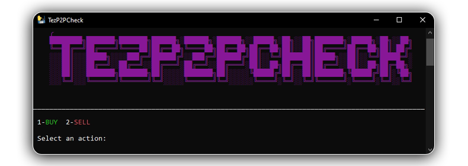
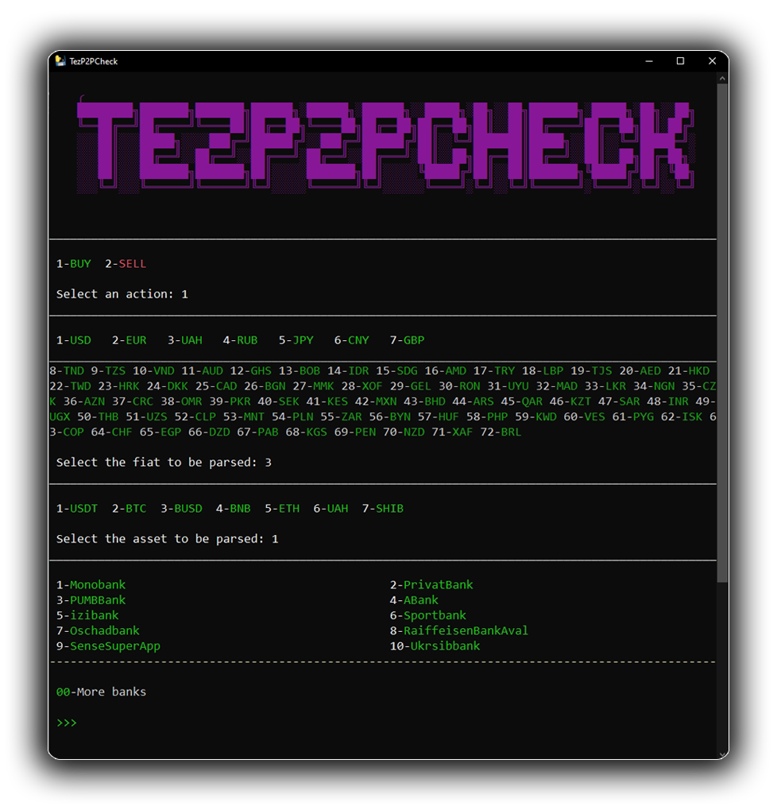

    <h1>🔥TezP2PCheck🔥</h1>

    <h5>Parser of p2p orders on binance.<em> Console version and Telegram bot</em></h5>
    <h5><em>idea:</em></h5>

    
When tracking the rate on the Binance P2P platform, when you just want to enter to check the rate or you are engaged in currency arbitrage, you often encounter the problem of long loading of the site and order loading. Go to the site-->🔄Wait for loading🔄-->Select fiat-->🔄Wait for banks to load🔄-->Select bank-->🔄Wait for loading🔄. Only after at least four loads we can see the result. Idea Project - Performance/Functionality. We get a much faster view orders 

 

    <h2>CONSOLE VERSION</h2>
    
    <h5><em>functionality:</em></h5>

    <ul>
        <li>📃Main page - page at start and exit from the result</li>
        <ul>
            <li><em>Search for a buy or sell order (select the number that appears on the screen)</em></li>
        </ul>
        <li>💵Currency</li>
        <ul>
            <li><em>Parsing all available currencies at the moment (will load itself if there are changes on the site)</em></li>
             <li><em>The most popular currencies are displayed at the top</em></li>
        </ul>
        <li>📈Сryptocurrency</li>
        <ul>
            <li><em>Parsing available cryptocurrencies by your currency</em></li>
        </ul>
        <li>🏦Banks</li>
        <ul>
            <li><em>Parsing of all available banks by currency at the moment</em></li>
            <li><em>If you enter "00" in the console, the next 90 banks will be displayed, if there are more than 90 - you will be prompted to enter "00" again then it will show all the banks in full</em></li>
            <li><em>You can enter a bank without the output of all banks (just select the number)</em></li>
        </ul>
        <li>✅Result</li>
        <ul>
            <li><em>Parsing ten orders from your data</em></li>
             <li><em>Outputs order type -> bank -> price cryptocurrency - fiat -> order volume.</em></li>
        </ul>
    </ul>

    
    

 
 
 

    <h2>TELEGRAM BOT</h2>
     <h5><em>underway...</em></h5>

